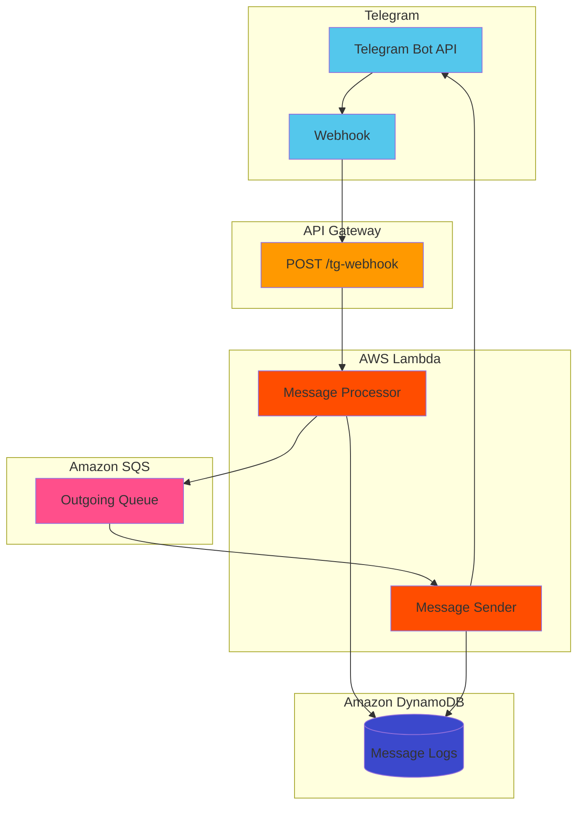

# Serverless Telegram Bot on AWS

A serverless Telegram bot implementation using AWS Lambda, API Gateway, SQS, and DynamoDB. The bot is deployed using AWS CDK and GitHub Actions.

## Architecture


## Features

- 🚀 Serverless architecture with AWS Lambda
- 📨 Message processing and sending via SQS queue
- 📝 Message logging in DynamoDB
- 🔄 Automated deployments via GitHub Actions
- 🌍 Environment-based deployments (dev/prod)

## Tech Stack

- **Infrastructure**: AWS CDK deployment with TypeScript
- **AWS Services**:
  - Lambda for serverless compute
  - API Gateway for webhook endpoint
  - SQS for message queueing
  - DynamoDB for message persistence
- **CI/CD**: GitHub Actions

## Project Structure

```
.
├── bin/                    # CDK app entry point
│   └── my-aws-infra.ts    # Main CDK application
├── lib/                    # CDK stack definition
│   └── serverless-tg-bot-stack.ts
├── lambdas/               # Lambda function code
│   ├── tg_message_processing.py
│   └── tg_message_sender.py
├── .github/workflows/     # GitHub Actions workflows
│   └── aws-deploy.yml
├── cdk.json              # CDK configuration
├── tsconfig.json         # TypeScript configuration
└── package.json          # Node.js dependencies and scripts
```

## Deployment

The project uses GitHub Actions for automated deployments:
- Push to `develop` branch → deploys to dev environment
- Push to `main` branch → deploys to production environment

### Environment Configuration

#### GitHub Environment Secrets
Configure these in repository Settings → Secrets and variables → Actions → Variables:
- `TELEGRAM_BOT_TOKEN`: Your Telegram bot token from @BotFather
- `AWS_ACCESS_KEY_ID`: AWS access key for deployment
- `AWS_SECRET_ACCESS_KEY`: AWS secret access key for deployment

#### GitHub Environment Variables
Configure these in repository Settings → Secrets and variables → Actions → Variables:
- `AWS_REGION`: AWS region for deployment (e.g., `us-east-1`)
- `AWS_ACCOUNT_ID`: Your AWS account ID

### Setting Up Telegram Webhook

After deploying your stack, you'll need to configure the Telegram webhook. Use one of these methods:

#### Method 1: Using cURL
Replace `{BOT_TOKEN}` and `{WEBHOOK_URL}` with your values:

```bash
curl -X POST https://api.telegram.org/bot{BOT_TOKEN}/setWebhook \
     -H "Content-Type: application/json" \
     -d '{"url": "{WEBHOOK_URL}"}'

```

#### Method 2: Using Web Browser
1. Get your webhook URL from the CloudFormation stack outputs
2. Visit this URL (replace with your values):
```
https://api.telegram.org/bot{BOT_TOKEN}/setWebhook?url={WEBHOOK_URL}
```

To verify webhook status:
```
https://api.telegram.org/bot{BOT_TOKEN}/getWebhookInfo
```

Note: The webhook URL should be HTTPS and publicly accessible.

## Message Flow

1. Telegram sends webhook POST request to API Gateway
2. Message Processor Lambda:
   - Logs incoming message
   - Validates incoming messages and creates response
   - Queues response in SQS
3. Message Sender Lambda:
   - Processes queued messages
   - Sends responses to Telegram
   - Logs outgoing messages

## License 📄

This project is licensed under the MIT License - see the [LICENSE](LICENSE) file for details.
